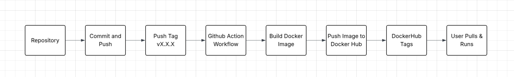

Project 4 CI Docker GitHub Actions DockerHub

Continuous Integration Project Overview
Goal
- Containerize my website with Docker
- Use GitHub Actions to build and push the image to DockerHub

Tools and roles
- Git and GitHub: store the repo and trigger workflows
- Docker - builds and runs the container image
- GitHub Actions: runs CI automatically
- DockerHub - stores the built images and tags

What is not working
- Nothing is not working (on my machine)

Diagram of the CI process



What happens in each place
Cloned repo
- I edit the website files in web-content
- I build and run the image locally to test

GitHub
- Stores my repo
- When I push a semver tag, it triggers the workflow to build and push the image

DockerHub
- Receives the pushed image
- Shows tags like latest, 1, and 1.0

Part 1 Create a Docker container image

Website content
- Folder: ./web-content/
- Files: ./web-content/index.html, ./web-content/dogs.html, ./web-content/styles.css

Dockerfile
- File: ./Dockerfile
- Base image: httpd:2.4
- Copies web-content into Apache default web directory

Dockerfile contents
```
FROM httpd:2.4
COPY web-content/ /usr/local/apache2/htdocs/
```

Build image from Dockerfile
```
docker build -t project3-site:latest 
```

Run container to serve the website
```
docker run --rm -p 8080:80 project3-site:latest
```

Verify website works
- http://localhost:8080
- http://localhost:8080/dogs.html (or click the hyperlink for dogs page)

Tagging requirements for DockerHub
- Images are tagged like username/repo:tag
- Example: owenkojola/project3-site:latest
- Using tags matters because latest gets overwritten and you need versions to roll back

DockerHub repo used for this project
- This must match IMAGE_NAME in .github/workflows/ci-dockerhub.yml
- DockerHub repo: owenkojola/project3-site
- Link: https://hub.docker.com/r/owenkojola/project3-site

Part 2 GitHub Actions and DockerHub

DockerHub PAT for GitHub Actions
How I created a PAT
- DockerHub account settings
- Personal access tokens
- Create token with Read and Write permissions

GitHub repository secrets
How I set secrets
- GitHub repo Settings
- Secrets and variables
- Actions
- New repository secret

Secrets used by the workflow
- DOCKER_USERNAME = owenkojola
- DOCKER_PAT = DockerHub PAT value

Workflow file
- .github/workflows/ci-dockerhub.yml

Workflow trigger
- Final version triggers on tag push vX.X.X only

Workflow steps
- Checkout repo
- Setup Docker Buildx
- Login to DockerHub using secrets
- Generate tags from the git tag version
- Build and push the image to DockerHub

Values to change if reused in another repo
- IMAGE_NAME in the workflow
- DockerHub repo name
- Secret names if different
- Docker build context and Dockerfile path if folder structure changes

Testing and validating

How to test workflow ran
- Push a semver tag and check the GitHub Actions run is green

Example tag commands
```
git tag -a v1.0.2 -m "Release v1.0.2"
git push origin v1.0.2
```

How to verify the DockerHub image works
```
docker pull owenkojola/project3-site:latest
docker run --rm -p 8080:80 owenkojola/project3-site:latest
```

Resources I used

ChatGPT for Errors I ran into like having the wrong name for the DOCKER_PAT secret, dockerhub PAT, and a few other small things. Not used to generate any of the project.

https://docs.docker.com/engine/reference/builder/

Main page I used for all of the docker stuff, had a lot of useful sub pages I visited below.

https://docs.docker.com/engine/reference/commandline/build/

Has all the flags and syntax for docker build, I ended up using my docker image from project03.

https://docs.docker.com/engine/reference/commandline/run/

Docker run parameters used for the docker container being removed when exited, detached, and always restart.

https://docs.docker.com/engine/reference/commandline/tag/

Docker image tag for latest, this is what I thought would make it only trigger once for latest.

https://docs.docker.com/engine/reference/commandline/push/

I don't think I actually used anything from this page, just one of the ones I visited while looking for other stuff I needed.

https://docs.docker.com/engine/reference/commandline/login/

Something I needed before I decided to just use project03 webpage, also was trying to figure out why it wasn't working because I accidentally deleted the PAT for my desktop.

https://docs.docker.com/docker-hub/access-tokens/

The actual page I was looking for to figure out why my PAT wasn't working (I deleted my PAT because it said I had never used it because I just made it.)

https://hub.docker.com/_/httpd

Another page I visited before deciding to use my project03 webpage.

https://httpd.apache.org/docs/

Same as above, was looking for something in the apache 2.4 docs I didn't end up using.

https://docs.github.com/en/actions

Github actions main page, used this to get to all the subpages below, most useful page I visited for this project.

https://docs.github.com/en/actions/security-guides/encrypted-secrets

I had an issue with my secrets, used this page to figure out that my syntax for YAML was wrong for my PAT.

https://github.com/actions/checkout

Used for checkoutv4 so that my workflow can access it.

https://github.com/docker/login-action

Used to figure out how to login to dockerhub using a github action.

https://github.com/docker/build-push-action

Used to build and push docker images from an action.

https://github.com/docker/metadata-action

Used with the Semvar flags for proper docker tags.

https://github.com/docker/setup-buildx-action

Part of the build-push-action stuff.

https://git-scm.com/book/en/v2/Git-Basics-Tagging

Used to learn how to use git tags for versioning.

https://semver.org/

Used to learn what each part of the vX.X.X meant and when to change them.